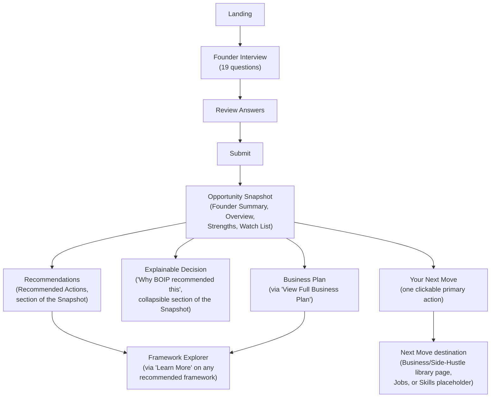
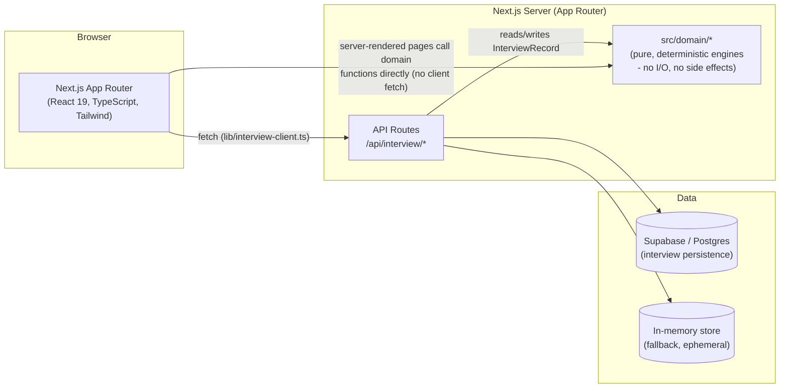

# BOIP v1.0 — Public Beta Product Specification

**Status:** Draft for approval
**Covers:** The platform exactly as it exists after v0.9.1 (Platform Hardening), plus what is required to reach a stable public beta
**Purpose:** This document is the contract between Product and Engineering. Every v1.0 implementation task must map back to a section here. Nothing in v1.0 should exist that isn't traceable to this document, and nothing in this document should describe a capability that isn't already built or explicitly scoped in as new v1.0 work.

---

## 1. Product Vision

**What BOIP is.** BOIP (Business Operating Intelligence Platform) is a structured discovery tool for early-stage founders. A founder answers a guided, 19-question interview about themselves and their idea, and BOIP deterministically produces a first structured read on it: an Opportunity Snapshot, ranked recommendations, an explainable route decision, framework guidance, and a complete Business Plan draft — all traceable back to the founder's own answers and BOIP's own curated knowledge, with no invented content.

**What it is not.** BOIP is not an AI advisor. It contains no LLM calls, no generative text, no invented facts, and no live market data. It is not a business-plan word processor, not a job board, not a course platform, and not (yet) a system of record — nothing a founder enters today is guaranteed to still exist tomorrow unless Supabase persistence is configured. It does not predict success, score viability, or claim expertise; every output is explicitly framed as a structured first read, not a verdict.

**Who it is built for.** An individual, early-stage founder — someone deciding whether to pursue an idea, a side hustle, or a job change — evaluating a raw idea or a vague direction, before they've invested real time or money in it, and before they're ready for (or able to afford) a human advisor, incubator, or consultant.

**What problem it solves.** Most people with a business idea have no structured way to pressure-test it. They either do nothing (analysis paralysis), or they jump straight to building without validating the customer, the model, or the market. BOIP closes that gap with a five-minute structured interview that produces an honest, explainable, and immediately actionable first assessment — replacing "I have a vague idea and don't know what to do next" with a named route, a ranked action list, and a reason for every recommendation.

---

## 2. Target Customer

**Founder stage.** Pre-idea to pre-revenue. Specifically: someone who has an idea, a problem they've noticed, or a vague direction ("I want to build something" / "I want a side hustle" / "I'm not sure if I should look for a job or start something"), but has not yet built anything, has not raised money, and has not made a firm commitment to a specific path.

**Business size.** Solo founder or a founding pair. Not a funded startup, not an existing SME looking to optimize operations — BOIP v1.0 has no capability aimed at an operating business (no financial modeling, no team/ops tooling, no investor-facing outputs).

**Typical problems.**
- "I have an idea but don't know if it's worth pursuing."
- "I don't know whether to look for a job, build a side hustle, or go all-in on a business."
- "I don't know what to do first."
- "I want a real business plan but can't afford a consultant and don't trust a generic AI chatbot to give me a straight answer."
- "I've read about frameworks like Lean Startup or Customer Discovery but don't know how to apply them to my situation."

**Why they would buy BOIP.** (Framed forward-looking — v1.0 beta ships without payments; see Section 5 and Section 9.) A founder in this position typically faces three alternatives: do nothing, pay for a consultant/coach they can't yet justify the cost of, or use a generic AI chatbot that invents plausible-sounding but unverifiable advice. BOIP's differentiated value is that every recommendation is **explainable and traceable** — the founder can see exactly which of their own answers and which BOIP knowledge rule produced each recommendation — at a price point and time investment (minutes, not sessions) accessible before they've validated the idea is worth a bigger spend. The willingness to pay is expected to come after the beta demonstrates the free experience is genuinely useful, not before.

---

## 3. Core Founder Journey

### Screens and transitions

| # | Screen | Route | Arrives from | Leaves to |
|---|---|---|---|---|
| 1 | Landing | `/` | Direct visit | "Start Interview" → Interview |
| 2 | Founder Interview | `/interview` | Landing, or resumed from a saved in-progress interview | "Next" through 19 questions → Review |
| 3 | Review Answers | `/interview/review` | End of interview | "Edit" → back to a specific question; "Submit" → Opportunity Snapshot |
| 4 | Opportunity Snapshot | `/interview/complete` | Submit | "Back to home" → Landing (resets); "View Full Business Plan" → Business Plan; "Learn More" on any framework → Framework Explorer; the Next Move's primary action → a Next Move destination |
| 5 | Business Plan | `/interview/business-plan` | Opportunity Snapshot | "Back to snapshot" → Opportunity Snapshot; "Learn More" on any framework → Framework Explorer |
| 6 | Framework Explorer | `/frameworks/[id]` | "Learn More" from a Recommendation Card, the Business Plan, or another Framework Explorer page's "related framework" | "Back to home" → Landing; related/next-framework links → another Framework Explorer page |
| 7 | Next Move destinations | `/business-plan/[id]`, `/side-hustle/[id]`, `/jobs`, `/skills` | The Next Move card's primary action | "Back to home" → Landing |

**Note on terminology.** "Recommendations" and "Explainable Decisions" (steps 4–5 in the conceptual journey diagram at the top of this document) are not separate screens today — they are sections within the Opportunity Snapshot screen: "Recommended Actions" (the ranked recommendation list) and "Why BOIP recommended this" (a collapsed-by-default explanation trace). This document describes the platform as it is; unifying these into distinct screens is not in scope for v1.0 unless explicitly added below.

**Note on Next Move destinations.** The Next Move card's one clickable primary action currently routes to one of four destinations depending on the founder's decided route: a library page for a matched business opportunity, a library page for a matched side-hustle opportunity, or one of two explicit placeholder pages (`/jobs`, `/skills`) that state plainly what isn't built yet rather than fabricating content. These placeholders are real, shipped v1.0 surface area — see Section 4.

---

## 4. Features Included in v1.0

Every feature below is already built as of v0.9.1. v1.0 does not add new capability; it hardens what exists into a public-beta-ready state (see Section 7).

### 4.1 Founder Interview
- **Purpose:** Capture a founder's profile and idea in a fixed, linear, 19-question flow, tagged by the capability that consumes each answer (Founder Discovery, Route Decision, Opportunity Matching).
- **Inputs:** Free text, single-select, and multi-select (capped at 3) answers.
- **Outputs:** `InterviewAnswers` — a flat id-keyed answer map.
- **Dependencies:** None (entry point).

### 4.2 Persistence
- **Purpose:** Auto-save progress and resume an in-progress interview across refreshes/return visits.
- **Inputs:** Each answer, plus the current question index, as the founder progresses.
- **Outputs:** A stored `InterviewRecord` (in-memory by default; Supabase/Postgres when configured).
- **Dependencies:** Founder Interview.

### 4.3 Opportunity Snapshot
- **Purpose:** The founder's first structured read on their idea — no AI, a rule-based synthesis of their answers.
- **Inputs:** `InterviewAnswers`.
- **Outputs:** `OpportunitySnapshot` (founder summary, opportunity overview, strengths, watch list).
- **Dependencies:** Founder Interview.

### 4.4 Recommendation Engine
- **Purpose:** Produce ranked, concrete next actions (priority, effort, impact, and the framework each draws on).
- **Inputs:** `OpportunityContext` (derived from `InterviewAnswers`).
- **Outputs:** `Recommendation[]`, sorted by priority, then impact, then effort.
- **Dependencies:** Founder Interview (via Opportunity domain).

### 4.5 Route Decision & Opportunity Matching
- **Purpose:** Decide which of five routes fits the founder (`business_plan`, `side_hustle`, `job_search`, `hybrid_path`, `skill_path`), and match against a curated Opportunity Library (16 entries) to produce a ranked Top 3 and one clickable Next Move.
- **Inputs:** `RouteContext` (normalized risk/urgency/capital/time/readiness bands, derived from `InterviewAnswers`).
- **Outputs:** `RouteDecision`, `OpportunityMatch[]`, `NextMove`.
- **Dependencies:** Founder Interview.

### 4.6 Decision Engine (Explainability)
- **Purpose:** Explain *why* BOIP recommended what it recommended, without ever re-deciding or overriding what the other engines already decided.
- **Inputs:** `InterviewAnswers` (re-evaluated for trace purposes only).
- **Outputs:** `Decision` (UI-facing: route, opportunities, recommendations, explanation) and `DecisionTrace` (signals, full rule evaluations — matched and unmatched — for auditability).
- **Dependencies:** Route Decision, Recommendation Engine, Opportunity Matching (reuses their output; does not recompute it).

### 4.7 Knowledge Catalog
- **Purpose:** BOIP's canonical identity layer — every permanent object (Framework, Recommendation, Opportunity, Rule) resolves to one metadata record through one resolver. Not a founder-facing feature; a platform capability every other feature depends on.
- **Inputs:** Each domain's own existing knowledge (frameworks, recommendations, opportunities, rules).
- **Outputs:** `CatalogEntry` (id, type, title, description, owner, capability, version, status, relationships), resolvable by id or by reverse relationship lookup.
- **Dependencies:** Framework, Recommendation, Opportunity, and Rule knowledge (reads it, never duplicates it).

### 4.8 Framework Explorer
- **Purpose:** BOIP's first Learning Capability — helps a founder understand a recommended framework (what it is, why it was recommended, when to use it, expected outcome, common mistakes, related frameworks).
- **Inputs:** A framework id (`FW-xxx`).
- **Outputs:** `FrameworkPage`, resolved entirely through the Knowledge Catalog.
- **Dependencies:** Knowledge Catalog only (never imports Recommendation, Opportunity, or Rule domains directly).

### 4.9 Business Plan Generator
- **Purpose:** A complete, deterministic Business Plan — Executive Summary, Business Opportunity, Target Customer, Revenue Model, Go-to-Market Strategy, First 90-Day Action Plan, Key Risks, Recommended Frameworks — assembled entirely from what BOIP already knows about the founder.
- **Inputs:** `InterviewAnswers` (read once, in the domain's mapper only).
- **Outputs:** `BusinessPlan` (eight ordered sections).
- **Dependencies:** Opportunity Snapshot, Decision Engine, Roadmap (consumes their output; Interview → Opportunity → Business Plan, never Interview → Business Plan directly).

### 4.10 Platform Hardening (v0.9.1)
- **Purpose:** Not a founder-facing feature — the reliability, testability, and accessibility foundation the beta stands on.
- **Inputs/Outputs:** N/A (cross-cutting).
- **Dependencies:** All of the above.
- **Includes:** A Vitest domain test suite (82 tests) and architecture boundary tests; a Playwright end-to-end suite covering the full founder journey; enforced public APIs (`src/domain/<name>/index.ts`) for every domain, with an ESLint rule preventing regressions; shared Loading/EmptyState/ErrorState UI states; a completed accessibility audit and fix pass (keyboard, focus, semantics, ARIA, contrast); and a low-risk static-rendering performance pass.

---

## 5. Features Explicitly Excluded

The following are **not** part of v1.0 and must not be introduced without a new, separately-approved specification:

- AI-generated advice, LLM calls, or any generative text of any kind
- Payments or billing (Stripe is planned, not integrated — see Section 6 and Section 10)
- Authentication or user accounts (no login, no founder identity beyond a locally-stored interview id)
- Founder Reports (a distinct, richer artifact than the Business Plan — not built)
- PDF or DOCX export of any output
- Collaboration (sharing, commenting, multi-user access to one founder's data)
- Multi-agent orchestration of any kind
- Live market data, live job listings, or live vacancy search (explicitly deferred — `/jobs` states this outright rather than fabricating listings)
- A Knowledge Graph or graph-based traversal (the Catalog does flat id-based relationship lookups only, by design)
- Analytics/product telemetry (PostHog is planned, not integrated)
- Production monitoring, structured logging, or alerting (see Section 7)

---

## 6. Technical Architecture

**Stack (as built):**
- **Next.js** (16.3.0, App Router) — server components by default; client components only where interactivity requires it (the interview wizard, multi-select controls)
- **React** 19, **TypeScript**, **Tailwind CSS** 4
- **Supabase** (Postgres) — optional interview persistence; the app falls back to an in-memory repository automatically when `SUPABASE_URL`/`SUPABASE_SERVICE_ROLE_KEY` aren't set, so it runs with zero external setup
- **Vitest** + **Playwright** — the v0.9.1 test suite (domain tests, architecture boundary tests, end-to-end tests)

**Stack (planned, not yet integrated — required before/at beta launch, scoped separately):**
- **Stripe** — no payments capability exists yet; not required for a free beta, required before any paid tier
- **Vercel** — the intended production deployment target; no production deployment has been configured or verified in this codebase yet
- **PostHog** — no analytics/telemetry exists yet; required to measure the Beta Success Criteria in Section 8 quantitatively

Key architectural properties (see `founder-interview-app/docs/ARCHITECTURE.md` for the full rationale):
- **Knowledge drives decisions. Engines evaluate knowledge. UI renders decisions.** No business logic is written as branching application code — it is data ("knowledge": rules, weights, curated text), evaluated by one shared, generic rule engine.
- **Domain boundaries are enforced, not just conventional.** Every domain exposes exactly one public import surface (`src/domain/<name>/index.ts`); deep imports are an ESLint error with zero exceptions, backed by independent architecture tests.
- **Two id systems:** permanent (`REC-xxx`, `FW-xxx`, `OPP-xxx`, `RULE-xxx` — BOIP's stable internal ontology) and runtime (`DEC-xxx`, `BP-xxx` — recomputed per evaluation, never persisted, never part of the ontology).
- **No AI anywhere in the stack today.**

---

## 7. Production Readiness Checklist

This checklist states current status as of v0.9.1, and what is still required to reach a stable public beta.

| Area | Status as of v0.9.1 | Required for beta |
|---|---|---|
| **Testing** | Vitest domain test suite (82 tests) + architecture boundary tests + Playwright E2E covering the full founder journey. Coverage reporting configured, no threshold. | Sufficient for beta as-is. A coverage threshold and CI wiring (tests running automatically on every PR) are recommended, not yet required. |
| **Accessibility** | Full manual audit completed (keyboard, focus, semantics, ARIA, screen reader, WCAG 2.1 AA contrast) and every finding fixed. | Sufficient for beta as-is. No automated accessibility testing (e.g. axe-core in CI) exists yet — recommended for ongoing regression protection, not a beta blocker. |
| **Performance** | Low-risk static pre-rendering for all known framework/opportunity pages. No load testing, no bundle-size budget, no CDN/caching strategy defined. | Acceptable for a beta at expected low initial traffic. Needs revisiting before any real marketing push. |
| **Security** | No authentication exists — every visitor is anonymous, with no accounts to compromise. Supabase credentials are server-only, never exposed to the browser. No rate limiting, no CSRF/CORS hardening beyond Next.js defaults, no dependency-vulnerability scanning configured. | Must decide and document the beta's identity model (fully anonymous vs. lightweight session-based) before launch — this is a product decision, not just an engineering one (see open question in Section 10). Rate limiting on the interview API routes is recommended before any public launch to prevent abuse. |
| **Privacy** | No privacy policy, no cookie/consent notice, no data-retention policy. Interview answers may include personal/business information with no stated handling commitment. | **Required before public beta launch.** A minimal privacy notice and a stated data-retention policy (especially given free-text answers) must exist before real users are invited in. |
| **Logging** | `console.error` only, for persistence failures; nothing structured, nothing centralized. | A basic structured logging setup (even just centralized error capture) is recommended before beta, so failures are discoverable without a user report. |
| **Monitoring** | None. No uptime checks, no error-rate alerting, no dashboards. | Recommended before beta: minimal uptime monitoring and an error-tracking service (e.g. Sentry or equivalent) wired into `app/error.tsx` and the API routes. |
| **Backups** | Supabase's own backup mechanism applies when persistence is configured; the in-memory fallback has no backup by design (data is lost on server restart). | The beta's persistence model must be decided (see Section 10 open question) — if Supabase is used in production, confirm its backup/retention settings meet the stated privacy policy. |
| **Error handling** | Every domain returns `null`/empty on a missing or invalid input rather than throwing; every page renders a shared `EmptyState`. A root error boundary (`app/error.tsx`) with a shared `ErrorState` and retry catches genuinely unexpected crashes. | Sufficient for beta as-is. |

---

## 8. Beta Success Criteria

Measurable outcomes that define a successful public beta (require PostHog or equivalent analytics — see Section 6 — to measure quantitatively; not yet instrumented):

- **Completion rate:** A meaningful majority of founders who start the interview finish it and reach the Opportunity Snapshot.
- **Business Plan generation success:** Every founder who reaches "View Full Business Plan" successfully receives a complete plan with zero errors — this is deterministic and should be at or near 100%.
- **Reliability:** No critical runtime failures (unhandled crashes, broken persistence, incorrect route/recommendation output) reported during the beta window.
- **Explainability engagement:** A measurable share of founders open "Why BOIP recommended this" — a proxy for whether the explainability feature is actually valued, not just present.
- **Framework Explorer engagement:** A measurable share of founders follow at least one "Learn More" link — a proxy for whether the Learning Capability is discovered and used.
- **Usability feedback:** Qualitative feedback (a feedback mechanism does not yet exist — required before beta launch to actually collect this) is net positive, with no recurring confusion about what BOIP is or isn't (e.g. founders mistaking it for an AI advisor, or expecting live job listings).

---

## 9. Known Limitations

Stated plainly, as intentional constraints of v1.0 — not defects:

- **Deterministic only.** Every output is rule-based. There is no AI, no LLM, no generative text anywhere in the product.
- **No authentication.** There is no concept of a founder account; an interview is only resumable via a locally-stored id in the same browser.
- **No payments.** The product is entirely free in v1.0; there is no tier, no paywall, no billing.
- **No exports.** A founder cannot download their Business Plan as a PDF, DOCX, or any other file — it exists only as a rendered page.
- **Ephemeral by default.** Without Supabase configured, all interview data is lost on server restart. Even with Supabase configured, there is no founder-facing data-deletion or data-export control.
- **Fixed interview.** The 19 questions are the same, in the same order, for every founder — there is no branching within the interview itself (branching happens only in how the answers are *interpreted* downstream, via the Route Decision engine).
- **Single-tenant experience.** No collaboration, no sharing, no multi-user access to one founder's plan.
- **No live data.** Opportunity matches come from a curated, static library (16 entries); nothing is fetched from a live market, job board, or real-time source.
- **No analytics.** Product usage is not currently measured, which limits how precisely Section 8's success criteria can be evaluated at beta launch (see Section 6).

---

## 10. Post-v1.0 Roadmap

Summarized, not scoped — each of these requires its own specification before implementation begins:

- **Founder Reports** — a richer, more comprehensive artifact than the Business Plan, likely synthesizing multiple sessions or a longer-term view
- **PDF/DOCX export** — of the Business Plan and/or a Founder Report
- **Authentication** — real founder accounts, enabling cross-device resume, history, and data ownership
- **Payments** — Stripe integration, pricing model, paid tier definition
- **AI-assisted explanations** — a carefully-scoped, explicitly-labeled use of AI, additive to (not a replacement for) the existing deterministic explanation system
- **Knowledge Graph** — true graph traversal over the Catalog's relationships, beyond today's flat id-based reverse lookup
- **Multi-agent workflows** — orchestrated, specialized reasoning over a founder's data (dependent on the AI-assisted explanations phase landing first)
- **Enterprise features** — team accounts, cohort/accelerator-facing views, admin/reporting tooling
- **Analytics and observability** — PostHog integration, structured logging, monitoring/alerting (some of this may need to land *before* beta launch per Section 7, not strictly "post-v1.0")
- **Architectural evolution flagged during v0.9.1** — a true evaluation graph (Interview Signals → Knowledge Evaluation → Decision → Recommendations/Opportunity Matches → Framework References → Presentation) was discussed as the eventual replacement for today's parallel-pipeline evaluation, which would also naturally resolve TD-006 (the duplicate `matchOpportunities()` call in the `skill_path` route, deliberately left untouched through v0.9.1). Not scoped for v1.0.

---

## Open questions for Product before implementation begins

These are decisions this document surfaces but does not make — flagging rather than silently assuming an answer:

1. **Identity model for beta.** Fully anonymous (today's model, with all its resume/privacy tradeoffs) vs. some lightweight session mechanism, without going as far as full authentication (explicitly excluded, Section 5).
2. **Persistence commitment for beta.** Whether Supabase is required to be configured for the public beta launch (i.e., no founder should ever silently lose their data to a server restart) or whether the in-memory fallback's ephemerality is acceptable and should simply be disclosed.
3. **Feedback mechanism.** Section 8's usability criterion has no collection mechanism today — worth deciding whether this is in scope for v1.0 engineering work or handled outside the product (e.g. manual outreach).
4. **Privacy policy ownership.** Whether Product/Legal drafts this, or whether Engineering is expected to propose a first draft as part of v1.0 delivery.
